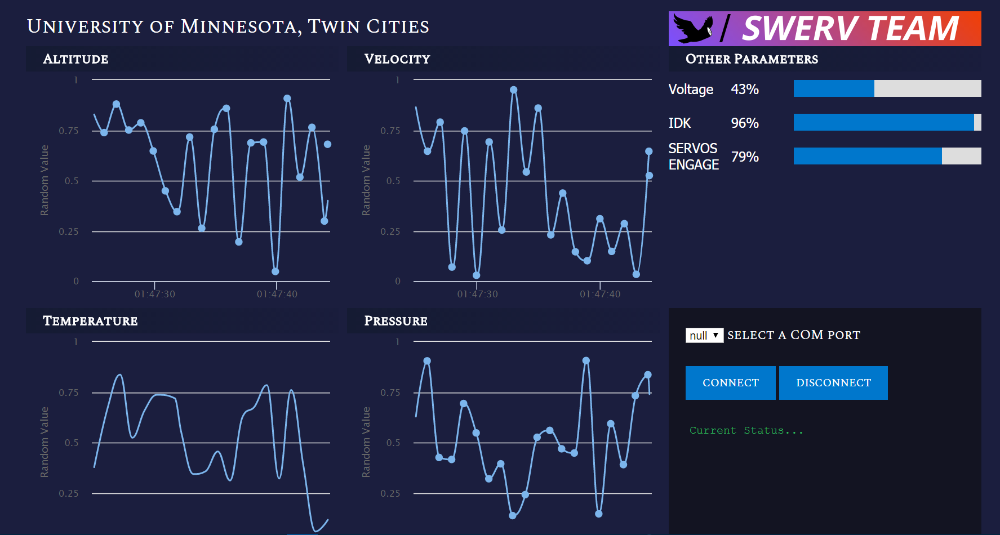

# UMN CANSAT GROUND STATION
**Init Date: Dec 1, 2017**<br>
Ground station that displays CANSAT telemetry data. Using web technology like HTML, CSS, NodeJS and Electron platform to build the software.

# Run Electron App
- Install NodeJS follow this [download link](https://nodejs.org/en/download/)
- Install Electron
```npm install electron --save-dev```
- In the *electron app* folder, run 
```
npm start
```
- Now the CANSAT app should open in full screen

# Current Design

# Inspring Design Mockup

<p>McClaren race car dashboard</p>


# What we need to show
*Altitude over time
*Pressure over time
